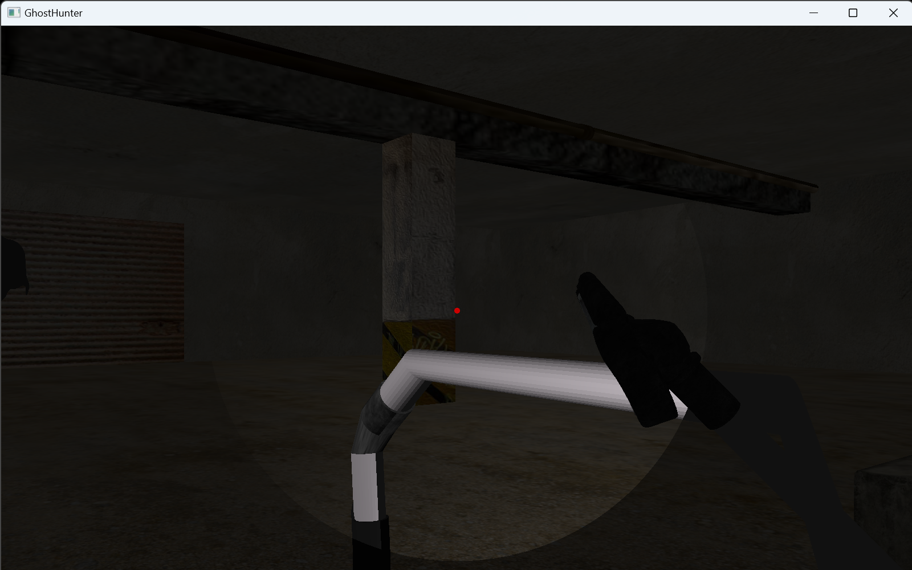
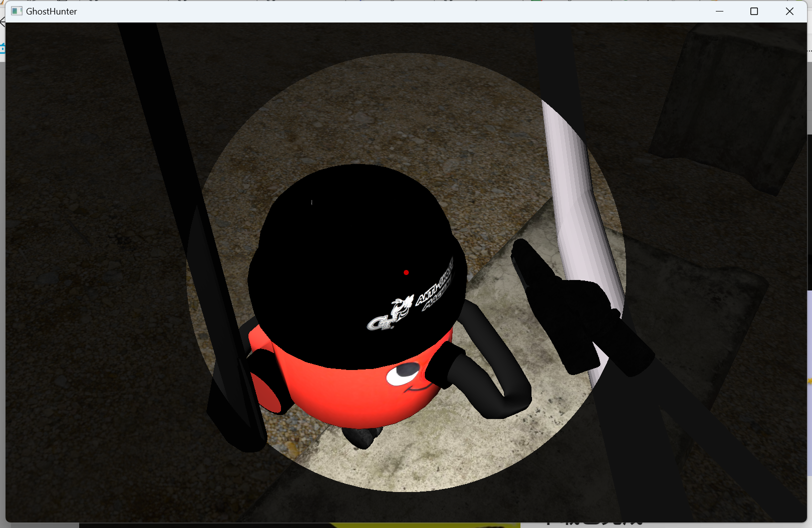

# GhostHunter

Ghost Hunter is a simple FPS game project developed by C++ and OpenGL . Players of the game will act as ghost hunters, using a vacuum cleaner to capture ghosts in a haunted house. 

## How to play

1. Player and Ghosts can not move in 5 seconds after game start.
2. Player can move with key 'w', 's', 'a', 'd' and control the view with mouse.
3. Player shoot with vacuum when he/she right click.
4. vacuum works if and only if the aiming ghost is in 5 meters.
5. if the ghost touched the player, game over, player lose.

## How to build&run

- build: Just build in **visual studio 2022** in Windows **x86** architecture.
- run directly:  run `./Excutable/GhostHunter/GhostHunter.exe`

## Pictures

Lose the game

Win the game

## Reference

[LearnOpenGL](https://github.com/JoeyDeVries/LearnOpenGL)

[Shoot Game](https://github.com/joohnyoung/Shoot-Game)
