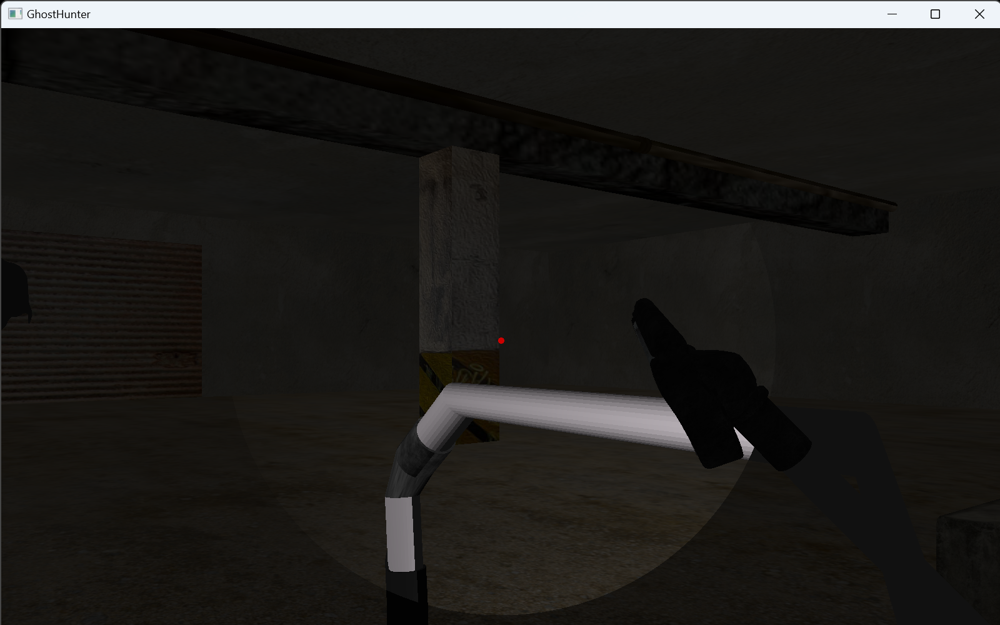
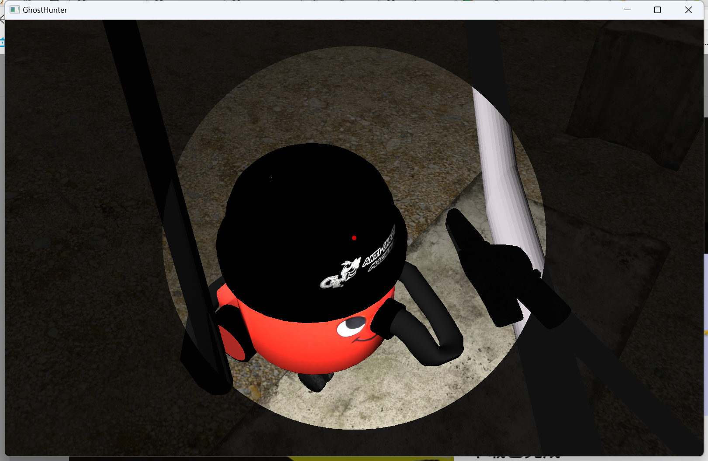

# GhostHunter

> A simple first-person ghost-catching game built with C++ and OpenGL.
>
> Course final project for **ECE 6122 — Advanced Programming Techniques**,
> Georgia Tech, Fall 2023. Originally proposed as a custom team project
> (approved in lieu of the default 3D-animated-scene assignment); this
> repository contains my implementation.

Ghost Hunter is a simple FPS game project developed by C++ and OpenGL. Players of the game will act as ghost hunters, using a vacuum cleaner to capture ghosts in a haunted house.

## Features

- First-person camera with WASD movement, mouse-look, and jump
- Four animated ghost objects, each driven by its own `std::thread`
- Per-ghost flickering internal light (random intensity)
- Vacuum-cleaner shooting mechanic with limited charges and reload (`r`)
- AABB-based collision detection against the level geometry and other entities
- Win/lose state with end-of-game emoji and auto-exit
- Cross-platform CMake build (Windows / macOS / Linux)

## How to play

1. Player and Ghosts can not move in 5 seconds after game start.
2. Player can move with key 'w', 's', 'a', 'd' and control the view with mouse.
3. Player shoot with vacuum when he/she left click.
4. vacuum works if and only if the aiming ghost is in 5 meters.
5. if the ghost touched the player, game over, player lose.

## Build & Run

The project builds on **Windows**, **macOS** and **Linux** from a single
CMake configuration. The required runtime is OpenGL 3.3 Core, GLFW and
Assimp; `glad`, `glm`, `stb_image` are vendored inside `include/`.

### Quick start (any platform)

```sh
cmake -S . -B build
cmake --build build --config Release
```

The executable lands in `build/bin/GhostHunter/` and a copy of `res/` is
staged at `build/bin/res/` so the game can be launched directly. At
startup the program `chdir`s to its own directory, so it works regardless
of where you invoke it from.

### Platform notes

#### Windows

By default uses the prebuilt `glfw3.lib` / `assimp-vc143-mt.lib`
shipped under `lib/`. Tested with Visual Studio 2022 (toolset v143):

```sh
cmake -S . -B build -G "Visual Studio 17 2022"
cmake --build build --config Release
```

To opt out of the vendored binaries (e.g. for MinGW / clang-cl) add
`-DGHOSTHUNTER_USE_VENDORED_DEPS=OFF`; CMake will then either find an
installed GLFW/Assimp or fetch them via `FetchContent`.

#### macOS

Tested on macOS 12+ (Apple Silicon and Intel). The project links against
the deprecated-but-still-shipped OpenGL 3.3 Core framework via GLFW.

**1. Install prerequisites**

```sh
xcode-select --install                  # Apple Clang + Command Line Tools
/bin/bash -c "$(curl -fsSL https://raw.githubusercontent.com/Homebrew/install/HEAD/install.sh)"   # skip if Homebrew is already installed
brew install cmake glfw assimp
```

**2. Configure & build**

```sh
git clone https://github.com/SaltedFish-No1/GhostHunter.git
cd GhostHunter
cmake -S . -B build -DCMAKE_BUILD_TYPE=Release
cmake --build build --parallel
```

**3. Run**

```sh
./build/bin/GhostHunter/GhostHunter
```

**Variations**

- *Without Homebrew:* omit `brew install glfw assimp`. CMake will pull
  both libraries from source via `FetchContent` automatically (first
  configure takes a few minutes).
- *Apple Silicon + Homebrew on Intel path (`/usr/local`):* CMake usually
  picks the right one, but if `find_package(glfw3)` fails point it at
  the right prefix:
  `cmake -S . -B build -DCMAKE_PREFIX_PATH="$(brew --prefix)"`.
- *Xcode generator:*
  `cmake -S . -B build -G Xcode && cmake --build build --config Release`.

If you see *"Failed to create GLFW window"* on launch, check that you
are running from a graphical session (not a headless SSH shell) and
that your GPU supports OpenGL 3.3 (every Mac since OS X 10.9 does).

#### Linux

```sh
sudo apt install libglfw3-dev libassimp-dev xorg-dev
cmake -S . -B build
cmake --build build
```

Without the system packages the same `cmake` command will pull GLFW
and Assimp from source via `FetchContent`.

### CMake options

| Option | Default | Notes |
| --- | --- | --- |
| `GHOSTHUNTER_USE_VENDORED_DEPS` | `ON` on Windows, `OFF` elsewhere | Use the prebuilt MSVC libs in `lib/`. |
| `GHOSTHUNTER_FETCH_DEPS` | `ON` | Fall back to `FetchContent` for any missing dependency. |

## Pictures





Lose the game


Win the game


## Acknowledgements

Originally a two-person team project for ECE 6122.
The course materials and assignment specification are © Georgia Tech and
are not redistributed in this repository.

## Reference

[LearnOpenGL](https://github.com/JoeyDeVries/LearnOpenGL)

[Assimp](https://github.com/assimp/assimp)

[stb](https://github.com/nothings/stb)
